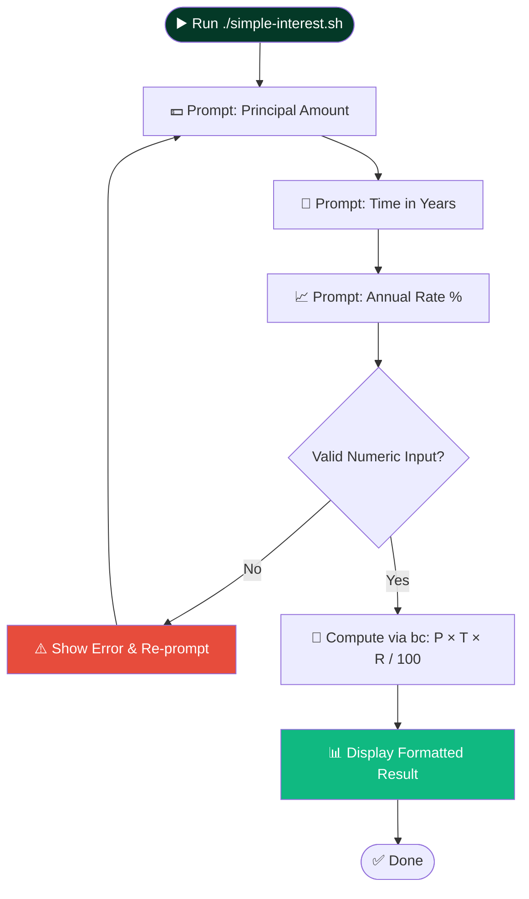
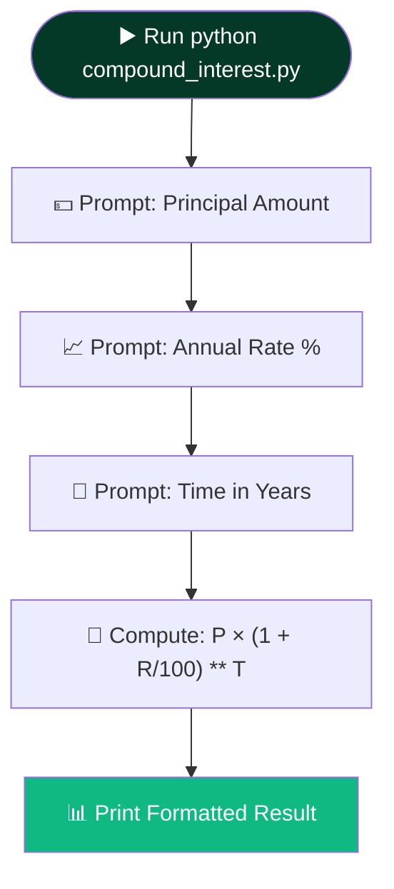

<a name="top"></a>
<div align="center">


<br/>


<br/><br/>


<br/><br/>


<br/><br/>


</div>

<br/><br/>

> A pair of lightweight, open-source interest calculators — one in Bash, one in Python — built as part of the **IBM "Introduction to Git and GitHub"** practicum. The repository follows the same open-source governance standard as a production project: a clear license, a code of conduct, and structured contribution guidelines, so it doubles as hands-on practice for both financial math and real GitHub workflows.

<br/>

<div align="center">

| ➗ Simple Interest | 📈 Compound Interest | 🌐 Cross-Platform | 📜 Governed |
|:---:|:---:|:---:|:---:|
| Linear growth, via Bash | Exponential growth, via Python | Linux, macOS, WSL | Apache 2.0 + Contributor Covenant |

</div>

<br/>

---

<br/>

## 📖 Table of Contents

<details open>
<summary><b>▼ Click to expand / collapse</b></summary>

<br/>

<table>
<tr>
<td valign="top">

- [✨ Features](#features)
- [🧮 The Two Formulas](#the-two-formulas)
- [🔄 Program Logic](#program-logic)
- [🚀 Quick Start](#quick-start)
- [💡 Usage Guide](#usage-guide)

</td>
<td valign="top">

- [📁 Repository Structure](#repository-structure)
- [👥 Open Source Governance](#open-source-governance)
- [🔀 Contribution Workflow](#contribution-workflow)
- [👤 Author](#author)
- [📜 License](#license)

</td>
</tr>
</table>

</details>

<br/>

> ⚠️ **A transparency note before you read further:** I have the exact source and example output for `simple-interest.sh` from earlier work on a sibling repo, but I have **not seen the actual source code of `compound_interest.py`** — only its filename. Every detail below about the Python script (its prompts, output format, and exact formula variant) is a reasonable inference based on standard compound-interest implementations, clearly marked where it appears. Please verify those specific sections against your real script before relying on them.

<br/>

---

<br/>

## ✨ Features

| | Feature | Script |
|:---:|---|:---:|
| ⚡ | Floating-point precision via `bc` | `simple-interest.sh` |
| 🎨 | ANSI-colored terminal banners | `simple-interest.sh` |
| 🛡️ | Numeric input validation | `simple-interest.sh` |
| 📈 | Exponential growth calculation *(inferred)* | `compound_interest.py` |
| 🐍 | Native Python floating-point math *(inferred)* | `compound_interest.py` |
| 🌐 | Runs on Linux, macOS, WSL, Git Bash | Both |
| 📜 | Apache 2.0 licensed, open governance | Repository-wide |

<br/>

---

<br/>

## 🧮 The Two Formulas

<div align="center">

**Simple Interest** — grows in a straight line; interest only ever applies to the original principal.

$$\text{Simple Interest} = \frac{P \times T \times R}{100}$$

<br/>

**Compound Interest** — grows exponentially; each period's interest gets added back into the principal before the next period is calculated.

$$\text{Compound Amount} = P \times \left(1 + \frac{R}{100}\right)^{T}$$

</div>

| Symbol | Meaning |
|:---:|---|
| **P** | Principal Amount ($) |
| **T** | Time Period (Years) |
| **R** | Annual Rate of Interest (%) |

<br/>

**Side by side:**

| Aspect | Simple Interest | Compound Interest |
|---|---|---|
| Growth pattern | Linear | Exponential |
| Interest earned on | Principal only | Principal + accumulated interest |
| Typical real-world use | Short-term loans | Savings & long-term investments |

<br/>

---

<br/>

## 🔄 Program Logic

**`simple-interest.sh`** — confirmed against the actual script:



<br/>

**`compound_interest.py`** — *inferred structure only, not verified against the real source:*



<br/>

---

<br/>

## 🚀 Quick Start

### Prerequisites

<table>
<tr><th>For</th><th>Requires</th><th>Install</th></tr>
<tr>
<td>🐚 <code>simple-interest.sh</code></td>
<td>Bash + GNU <code>bc</code></td>
<td>

```bash
# Debian / Ubuntu / Mint
sudo apt-get update && sudo apt-get install -y bc bash

# macOS (Homebrew)
brew install bc

# Arch Linux
sudo pacman -S bc
```

</td>
</tr>
<tr>
<td>🐍 <code>compound_interest.py</code></td>
<td>Python 3</td>
<td>

```bash
python3 --version   # confirm Python 3 is installed
```

</td>
</tr>
</table>

<br/>

### Installation

```bash
git clone https://github.com/Talha-Yaseen-Hub/mcino-Introduction-to-Git-and-GitHub.git
cd mcino-Introduction-to-Git-and-GitHub
chmod +x simple-interest.sh
```

<br/>

---

<br/>

## 💡 Usage Guide

### ➗ Simple Interest (Bash)

```bash
./simple-interest.sh
```

```text
========================================================
          📊 SIMPLE INTEREST CALCULATOR                
========================================================

Enter the principal amount ($): 1000
Enter time period in years: 3
Enter annual rate of interest (%): 5

========================================================
Calculated Simple Interest: $150.00
========================================================
Thank you for using the Simple Interest Calculator!
```

<br/>

### 📈 Compound Interest (Python)

```bash
python3 compound_interest.py
```

> ⚠️ *Illustrative example only — reflects the standard formula, not verified real output from your script:*

```text
Enter the principal amount ($): 1000
Enter annual rate of interest (%): 5
Enter time period in years: 3

Compound Amount: $1157.63
Compound Interest Earned: $157.63
```

<br/>

---

<br/>

## 📁 Repository Structure

```text
mcino-Introduction-to-Git-and-GitHub/
├── 📂 .github/                # Repository workflow configuration
├── 🚫 .gitignore
├── 🤝 CODE_OF_CONDUCT.md      # Community behavior standards
├── ✍️ CONTRIBUTING.md          # Contribution guidelines
├── 📜 LICENSE                 # Apache License 2.0
├── 📄 README.md               # Project documentation (this file)
├── 📈 compound_interest.py     # Python compound interest calculator
└── ➗ simple-interest.sh       # Bash simple interest calculator
```

<br/>

---

<br/>

## 👥 Open Source Governance

| Document | Purpose |
|---|---|
| 📜 **[License](LICENSE)** | Released under the [Apache License 2.0](https://www.apache.org/licenses/LICENSE-2.0) |
| 🤝 **[Code of Conduct](CODE_OF_CONDUCT.md)** | Community behavior and interaction standards |
| ✍️ **[Contributing Guide](CONTRIBUTING.md)** | Steps for reporting bugs, submitting features, and opening Pull Requests |

<br/>

## 🔀 Contribution Workflow


<br/>

---

<br/>

## 👤 Author

<div align="center">

### Talha Yaseen
*Software Engineer | Tech Enthusiast*

<br/>

<a href="https://github.com/Talha-Yaseen-Hub">
  
</a>
<a href="https://talha-yaseen.vercel.app/">
  
</a>
<a href="mailto:talhavectorarts@gmail.com">
  
</a>

</div>

<br/>

---

<br/>

## 📜 License

<div align="center">


<br/><br/>

Released under the **Apache License 2.0** (Copyright IBM Developer Skills Network, retained from the original template) — see the [LICENSE](./LICENSE) file for full details.

</div>

<br/><br/>

<div align="center">

<em>Built while learning Git & GitHub — one commit at a time.</em>

<br/><br/>

[⬆ Back to Top](#top)

<br/><br/>


</div>
